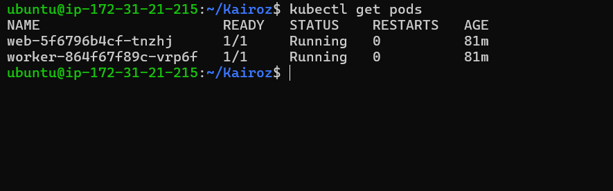
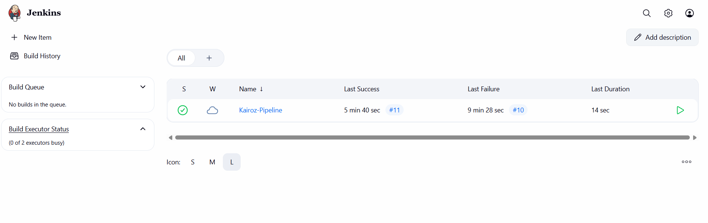

Kairoz: Jenkins for end-to-end CI/CD on GKE
  **Overview of the Project**
 Built with an emphasis on clean CI/CD pipelines using Jenkins, GKE Autopilot, and Artifact Registry, Kairoz is a cloud-native, multi-pod Kubernetes application.  The package consists of:

 A front-end web service

 A worker background processor.

 Docker-based microservices

 Jenkins-powered pipeline for continuous deployment

 hosted via GKE Autopilot on Google Cloud Platform

**Stack Employed**:

 Jenkins (EC2-hosted) for CI/CD

 GKE Autopilot for orchestrating containers

 GCP Container Registry for Container Image Storage

 Docker for containerization

 GitHub for version control

**Flow of Deployment (Step by Step)**:

 1. Configuration of the Environment
 launched an Ubuntu EC2 machine with a public IP address.

 Installation and configuration:

 Jenkins (manual configuration plus plugin installation)

 Docker, Google Cloud CLI, and Git

 Generated a GCP service account with the required IAM roles:

    roles/container.admin

    roles/storage.admin

    roles/storage.objectViewer

 2. Configuring the GKE Cluster:
 established a GKE Autopilot cluster in us-central1 with the name autopilot-cluster-1.

 Kubectl was configured on EC2.

 3. Docker & Container Registry:

 Enabled Container Registry and created a repo (e.g. kairoz-docker)
 
 Tagged and pushed Docker images to GCP

 4. K8s Manifests:

 Updated web-deployment.yaml and worker-deployment.yaml with Google container Registry image paths

 applied Kubernetes manifests 

 5. The Jenkins Pipeline:

 created Kairoz-Pipeline, a freestyle Jenkins task.

 uploaded the code to the ubuntu 

 create Docker images

 transfer to the container registry

 using Kubectl, deploy to GKE
 
 Built the job using CLI

**Final Status**:

Jenkins pipeline runs flawlessly

Pods (web & worker) running and stable

Services exposed using NodePort (ready for LoadBalancer)

CI/CD fully automated from Git to GKE

**Key Learnings**:

To ensure seamless Jenkins operations, EC2 t2.micro was upgraded to t3.medium because it was slow.

GCP IAM requires careful configuration – Container Registry requires explicit pull permissions.

GKE Autopilot does not require node provisioning, but be mindful of image permissions!

